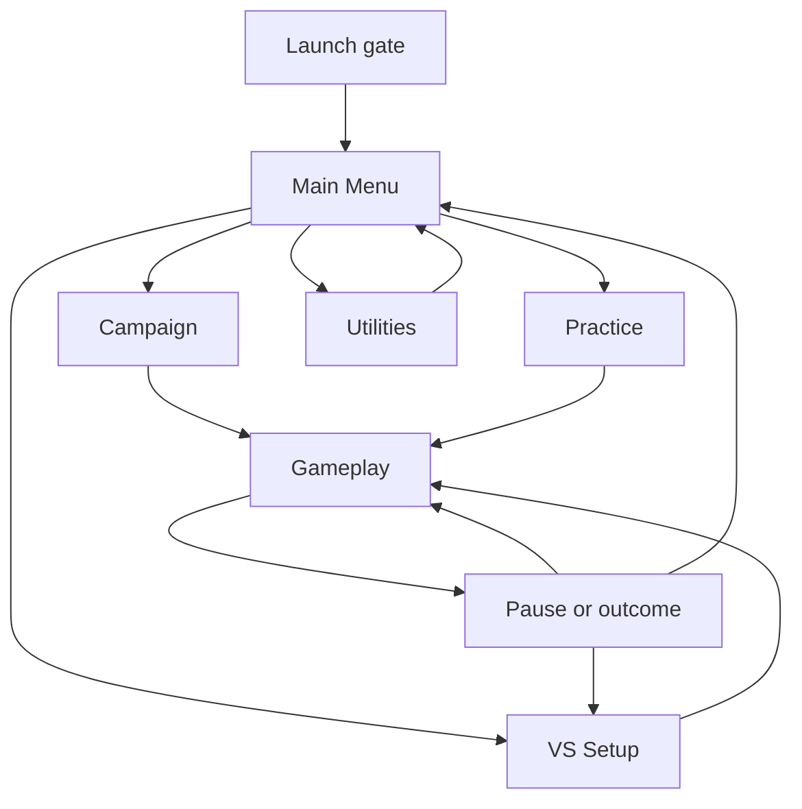

# UI/UX direction for Public Prototype 1.0

Approved 2026-08-23 after a repository-wide review of the implementation, player-facing
flows, responsive evidence, gallery/visual tooling, plans/specifications, and relevant open
and closed issues and pull requests.

This document is the authoritative product-design direction for the public prototype and the
foundation intended to carry into later commercial development. It is deliberately more than
a visual polish pass. The current interface works, but its application/session/navigation
architecture now constrains clarity and quality of life. Public Prototype 1.0 should fix that
architecture rather than accumulate more conditional panes and reboot workarounds.

The [public prototype and campaign direction](./2026-08-22-project-direction.md) remains the
authority for repository scope. The
[campaign/run model](./2026-08-11-campaign-run-model.md) remains authoritative for campaign,
run, attempt, practice, and persistence semantics. Feature-level Stats, Achievements,
Customization, and spawn/death specifications remain useful implementation records where this
document does not replace their placement or navigation.

## 1. Executive assessment

### What already works

- The game has a recognizable tabletop/felt identity. Its programmed arena, tank silhouettes,
  dark overlays, green primary action, and restrained HUD fit a lightweight successor to Wii
  Play Tanks.
- Gameplay is usually allowed to dominate the screen. The basic Lives/Enemies and VS stock
  projections are directionally appropriate; the goal is to contextualize them, not fill the
  arena with interface.
- Campaign-run persistence, Practice isolation, Statistics, Achievements, Customization,
  Pause, touch controls, controller assignment, haptics, VS modes, and VS setup all provide
  real product capability rather than mock UI.
- The deterministic simulation/gallery infrastructure is unusually strong for a prototype and
  can support repeatable UX evidence.
- Recent work has already corrected important local defects: mobile pause, responsive VS slot
  reflow, campaign-only HUD leakage in VS, and campaign-run persistence.

### What remains prototype-quality

The dominant problem is structural rather than cosmetic.

- `src/game/state.ts` uses one `GameState` for a state named `title` that is actually Main Menu,
  gameplay, Pause, and outcomes. Application location, session kind, and gameplay phase are
  not separate concepts.
- `src/game/hud.ts` and `src/game/hud.css` have grown to roughly 2,800 and 1,700 lines. Many
  screens are sibling panes toggled by classes rather than routes with history and ownership.
- Campaign/VS switching can replace the entire game handle and recreate HUD/audio-facing state.
  The new HUD starts at Splash, creating repeated launch/title steps that are lifecycle artifacts.
- Main Menu exposes too many peer actions and settings. Continue, New Game, Stats,
  Achievements, Customize, Levels, Controllers, Versus, and settings controls compete without
  a clear play-first hierarchy.
- The current default VS flow can require five confirmations: initial Launch, Versus, setup
  Start, another Splash gesture, and Start Match. The accepted setup is not yet guaranteed to
  reach the new session's slot assignments.
- Back/Quit destinations are encoded locally. VS Quit can run campaign-oriented landing logic;
  Settings cannot reliably return to its actual origin; focus restoration is not modeled.
- Keyboard focus is mostly flat DOM-order traversal. That is inadequate for controller D-pad
  navigation through grids, wrapped slot cards, or TV layouts.
- Audio controls and gameplay status can occupy persistent chrome even when they are irrelevant.
- Responsive CSS mostly reflows or shrinks existing surfaces. Phone portrait needs its own
  arena/control composition, and TV needs an explicit couch-distance scale and safe region.
- Reduced-motion coverage is incomplete; several selected/identity states rely too heavily on
  color/border; disabled states do not consistently explain how to become valid.
- Visual tooling protects deterministic gameplay moments but does not yet cover the complete
  route/overlay/error/responsive interface matrix.

### Product conclusion

Public Prototype 1.0 needs an **application-shell and interaction-system reset**, followed by
screen redesigns. It does not need a framework migration, decorative overhaul, or dashboard
navigation. Preserve the game's identity and lightweight feel; replace the state ownership,
navigation, and repeated one-off UI patterns underneath it.

The target is: **minimal friction, strong hierarchy, obvious actions, consistent interaction**.

## 2. Proposed information architecture

### Major player paths

### Complete hierarchy

- **Launch** — one page-level audio/input gesture, shown once per document load.
- **Main Menu**
  - Continue Campaign / Start Campaign — primary.
  - Versus.
  - Practice.
  - Customize.
  - Records.
    - Stats.
    - Achievements.
  - Settings.
    - Audio.
    - Controls.
    - Accessibility.
    - Data.
    - About & Legal.
  - Developer Tools — conditional on effective developer mode only.
  - About/Privacy/Credits utility destination.
- **Gameplay overlays**
  - Pause.
  - Destructive confirmation.
  - Blocking error/recovery dialog.
- **Gameplay outcomes**
  - Mission Clear.
  - Campaign Over.
  - Campaign Complete.
  - Practice result.
  - VS result.

Controllers are contextual to VS Setup or Controls settings, not a permanent Main Menu peer.
Reset actions live under Settings → Data, not Records. Developer controls never appear in
ordinary Settings.

### State ownership

| Concept | Owns | Does not own |
| --- | --- | --- |
| `AppRoute` | Launch, Main Menu, Practice, VS Setup, Settings, Records, Customize, Developer Tools | Playing/paused/win/lose simulation phase |
| `SessionDescriptor` | Campaign/Practice/Versus identity and validated configuration | Screen history or transient focus |
| `GameplayPhase` | Playing, paused, respawn/attempt transition, mission/match outcomes | Which app route opened Settings |
| Route stack | Full-screen destination history and origin | Blocking dialog order |
| Overlay stack | Pause, confirmations, blocking dialogs | Permanent navigation destinations |
| App shell | Routes, settings/audio, capabilities, shared UI roots | Authoritative simulation state |
| Session host | Create/start/stop/dispose one game session | Page-level Launch or global route history |

### Full screen versus overlay

| Surface | Form | Reason |
| --- | --- | --- |
| Main Menu, VS Setup, Practice, Settings, Records, Customize, Developer Tools | Full application route | They need responsive layout, origin-aware Back, and persistent context. |
| Pause | Overlay on frozen gameplay | The player has not left the session. |
| Replace-active-run confirmation | Modal overlay | It blocks one destructive action and should return to its origin. |
| Invalid field guidance | Inline status | A modal would add friction and hide the configuration needing correction. |
| Mission/Match result | Gameplay outcome layer | It belongs to the completed session but offers explicit route/session actions. |
| Unsupported renderer or fatal load failure | Full shell state | No playable session exists beneath it. |

### Persistence contract

| State | Persistence |
| --- | --- |
| Campaign run/progression/stats/achievements/customization | Existing durable stores and schemas. |
| Audio, control scheme, haptics/rumble, reduced motion/flash, UI scale | Versioned player settings store. |
| Last valid VS rules, role pattern, teams, bot difficulty, selected arena | Durable, sanitized convenience state. |
| Exact connected gamepad indices and current focus | Page session only. |
| Route/overlay history and scroll position | Page session only. |
| Practice attempt | Transient unless later product direction explicitly makes it resumable. |

## 3. Screen-by-screen redesign

### Launch / initial load

**Purpose:** satisfy the browser's first interaction/audio requirement and establish the game's
identity without creating a second menu.

**Primary action:** input-aware Start/Continue prompt. Pointer/touch, Enter/Space, or an assigned
controller Confirm must work.

**Layout:** title/mark, a short prompt, restrained background arena/table treatment, and only
essential loading/error status. The gate should visually transition into Main Menu rather than
cutting to a second title screen.

**Navigation and persistence:** shown at most once per document load. Internal Campaign,
Practice, VS, rematch, or developer session changes never return here.

**Responsive/accessibility:** large type, safe-area padding, no rapid intro animation, and an
immediate reduced-motion path. Loading and unsupported-renderer states use the same shell rather
than raw browser text.

### Main Menu

**Purpose:** start the intended play mode with the least interpretation.

**Primary action:** Continue Campaign when an active run exists; otherwise Start Campaign. Show
only the current mission and remaining run lives needed to build confidence.

**Secondary actions:** Versus and Practice. Customize, Records, and Settings are quieter utility
actions. Start New Campaign is tertiary while a run exists and confirms because it replaces data.

**Layout:** one centered play card or shallow two-region composition—not a dashboard. Keep the
primary action visually dominant, two secondary play actions nearby, and utilities compact.
Developer Tools is conditional; About & Legal lives in a footer/utility region.

**Navigation and persistence:** Main Menu is the application root. Back from a child returns here
and restores the invoking control. Main Menu from gameplay always returns here directly.

**Device behavior:** desktop/TV keeps all primary choices in the first view. Phone may scroll
utilities, but Campaign/Versus/Practice remain immediately reachable. Controller default focus is
the Campaign action.

### Campaign entry and progression

**Purpose:** resume or begin the one authored campaign run.

**Primary action:** Continue/Start enters gameplay directly; no separate campaign confirmation
screen.

**Secondary actions:** when a run exists, Start New Campaign with a concise destructive
confirmation. Campaign details may show current mission/lives but must not become a second menu.

**Persistence:** use the first-class active run exactly as stored. Main Menu, refresh, Practice,
and VS do not replenish or advance it.

### Practice / level selection

**Purpose:** provide isolated level learning without risking campaign state.

**Primary action:** select an unlocked mission and Start Practice directly.

**Information:** mission name, small arena preview, enemy/objective summary, and an explicit
“Practice does not affect your campaign run” line. Locked entries show a concise reason, not a
generic disabled button.

**Layout:** card/list on phone; preview-plus-list on desktop/TV. Remember the last highlighted
level. Back returns to Main Menu and does not modify the campaign.

### VS Setup

**Purpose:** produce one understandable, valid, playable local match configuration.

**Primary action:** Start. It remains visible/reachable and enters gameplay directly.

**Secondary action:** Back to Main Menu. Reset to defaults may live under a quiet overflow/advanced
area only if testing shows it is useful.

**Information hierarchy:**

1. Mode and player count.
2. Arena choice with preview and intent.
3. Stock.
4. Player slot cards: source, applicable team, applicable bot difficulty.
5. Teams-only friendly fire.
6. Collapsed Advanced Rules: shell and mine caps.
7. Start state and one actionable validation message.

| Desktop / TV composition | Phone composition |
| --- | --- |
| Left region: Match (mode, players, arena preview, rules). Right region: Players (2–4 slot cards). Start remains in a stable primary-action area. | One owned scroll surface: heading, mode/count, arena card, 2×2 or stacked slots, contextual rules, validation, sticky/reachable Start. No persistent top bar may clip the title. |

**Defaults:** This device occupies the applicable local slot. Available controllers may populate
additional slots; remaining required slots become Bots or explicitly require resolution. A valid
Start can never create inert tanks.

**Persistence:** remember the last valid rules, roles, teams, difficulty, and arena choice. Treat
exact physical gamepad indices as volatile and ask for reassignment after reload/disconnect.

**Navigation:** Back returns to Main Menu. Change Setup returns here from Pause/results with the
same configuration and focus. Navigation does not resolve Random or consume a seed.

### Settings

**Purpose:** provide durable preferences without competing with play actions.

**Primary/secondary actions:** changes apply immediately when safe; Back returns to the true
origin. Cancel exists only for deliberately staged/destructive operations.

**Information:** Audio, Controls, Accessibility, Data, About & Legal. Use progressive disclosure
and capability detection. Hide irrelevant touch/keyboard/haptic controls; do not make players
decode permanently disabled settings.

**Persistence:** mute, volume, applicable input preferences, device haptics/controller rumble,
reduced-motion/flash policy, and UI scale survive reload and internal session replacement.

**Pause origin:** Settings opened from Pause returns to Pause over the same session. Settings from
Main Menu returns to Main Menu.

### Customize

**Purpose:** choose appearance through immediate preview rather than gameplay trial and error.

**Primary action:** selection applies immediately and persists. Back returns to origin.

**Layout:** large/sticky tank preview plus a compact curated choice grid. Selected state uses a
check/label as well as fill/border. On phone the preview stays visible or quickly recoverable while
choices scroll beneath it.

**Future extension:** after spawn variants and reduced-motion alternatives are production-ready,
an Entrance selector may preview Warp/Rise/Beacon here. It is not a prerequisite for the core UI
architecture.

### Records

**Purpose:** browse progress without mixing information and destructive data administration.

**Primary structure:** Stats and Achievements as shallow tabs under one Records route.

**Terminology:** use Current attempt for the existing level-attempt bucket. Reserve Run for a
complete campaign attempt; use Practice and Lifetime explicitly.

**Layout:** compact grouped rows/cards with clear empty states. Avoid dense analytics-dashboard
charts unless a later metric genuinely benefits from visualization.

**Navigation/persistence:** remember the selected tab for the page session. Move Reset Stats,
Reset Progress, import/export, and related actions to Settings → Data.

### Gameplay HUD

**Purpose:** show only information that changes play decisions.

- Campaign: mission, run lives, and remaining enemies when useful.
- Practice: explicit Practice identity, local lives, and objective state.
- Versus: per-slot/team stock and match result; never Campaign Lives/Enemies.

Remove the always-visible yellow Mute/volume controls. Keep input-relevant shortcuts such as M with
a short accessible toast, and place durable audio controls in Settings. Touch gets a reachable
Pause affordance. HUD scale increases on TV and respects phone safe/control zones.

### Pause

**Purpose:** suspend the current session without making it feel abandoned.

**Primary action:** Resume.

**Secondary actions:** Settings plus contextual actions:

- Campaign: Restart/Retry only when its run-life semantics are explicit; Return to Main Menu.
- Practice: Retry and End Practice.
- Versus: Change Setup and Main Menu.

Do not use generic Quit when a destination can be named. Keep the frozen arena visible beneath a
dark scrim; continue the existing arena music context at a ducked level. Pause is an overlay and
Back/Pause resumes when no deeper modal is open.

### Death and respawn

Ordinary Campaign death with lives remaining requires **zero confirmation**. Persist the life
loss, pulse the life/stock readout once, play the distinct death effect, and begin the next attempt.
For shielded VS respawn, the entrance reaches opaque, eases into a clearly protected translucent
state, then returns smoothly to opaque. Ring position snaps to the chosen spawn and reinforces—but
does not solely communicate—protection.

Reduced motion keeps the timing/information while replacing unnecessary travel, scale, or flashing
with static/opacity/shape alternatives. No simulation timing changes with presentation policy.

### Campaign and Practice outcomes

| Outcome | Primary action | Secondary actions |
| --- | --- | --- |
| Mission Clear | Next Mission | Retry Mission where useful; Main Menu |
| Campaign Over | Start New Campaign | Main Menu |
| Campaign Complete | Start New Campaign | Records; Main Menu |
| Practice success/failure | Retry | Choose Level; Main Menu |

Use Mission Clear, Campaign Over, and Campaign Complete rather than generic Win/Lose. Never label
the start of a new run Retry.

### VS results

Show winner/team and only three navigation actions:

1. **Rematch** — same configuration, fresh seed, direct gameplay.
2. **Change Setup** — retained VS Setup, no match creation.
3. **Main Menu** — application root.

Rematch is primary and one activation. No action is labeled Versus Setup, Play Again, Continue, or
generic Quit when one of the exact actions above applies.

### Errors, unavailable, disabled, and invalid states

Use the application shell for loading, WebGL unavailable, resource-load failure, and fatal session
creation failure. Use concise inline guidance for invalid setup, disconnected controllers, locked
missions, and resolvable disabled actions. Blocking states always provide a valid Retry, Change
Setup, Settings, Back, or Main Menu action. Non-blocking storage fallback permits play and does not
repeat modal interruptions. Technical diagnostics remain in Developer Tools.

### Developer Tools

Developer Tools is a conditional, lazy-loaded application route. A compact persistent DEV chip is
acceptable while developer mode is active; ordinary Main Menu and Settings contain no developer
controls. It uses the same route, input, focus, primitive, responsive, and accessibility systems as
the player UI, while its isolated persistence and clean capture surface remain separate.

## 4. Major quality-of-life improvements

| Rank | Improvement | Why it matters |
| --- | --- | --- |
| 1 | Valid setup Start enters gameplay directly | Removes the most obvious repeated confirmation and restores trust in Start. |
| 2 | Persistent shell instead of full UI reboot | Eliminates repeated Splash, stale HUD, lost focus/settings, and lifecycle workarounds. |
| 3 | Semantic Back/history contract | Prevents surprise destinations and makes Settings/Pause/VS round trips reliable. |
| 4 | Safe VS role defaults and per-slot validation | Prevents matches with inert tanks and makes controller/Bot ownership obvious. |
| 5 | One play-first Main Menu | Reduces scanning and makes Campaign/Versus/Practice immediately understandable. |
| 6 | Contextual outcomes and Pause actions | Replaces ambiguous Retry/Quit/Continue labels with exact effects. |
| 7 | Zero-confirmation ordinary death retry | Keeps arcade pacing and avoids asking the player to confirm an inevitable attempt. |
| 8 | Remember useful choices | Removes repetitive setup while keeping volatile physical controller identity safe. |
| 9 | Progressive disclosure of Advanced Rules | Keeps VS approachable without removing supported tuning. |
| 10 | Input/capability-relevant controls | Removes dead settings and misleading keyboard/touch prompts. |
| 11 | Preview arenas/customization choices | Reduces trial-and-error launches and navigation churn. |
| 12 | Dedicated phone/TV compositions | Prevents clipping, tiny couch UI, and touch controls competing with the arena. |

## 5. Interaction system

| Action | Contract |
| --- | --- |
| Back | Remove exactly one overlay, otherwise one route; restore origin, focus, and meaningful scroll. Never mutate configuration or simulation. |
| Confirm | Activate the focused primary meaning once. A valid Start enters play; it never opens another Start screen. |
| Cancel | Close/discard the current staged or blocking layer without applying changes. Ordinary immediate settings do not pretend to need Cancel. |
| Pause | From gameplay, open Pause. From Pause with no deeper overlay, resume. Never leak into application routes. |
| Quit | Avoid generic wording. Replace with Return to Main Menu, End Practice, or Change Setup. |
| Retry | Repeat the same Practice/mission scenario under the documented life/run rules. It never means new campaign. |
| Rematch | Same VS configuration, fresh seed/resolved Random choice, direct gameplay. |
| Change Setup | Return to retained VS Setup without creating a match or consuming RNG. |
| Main Menu | Return directly to the application root; clear transient gameplay presentation, preserve documented durable state. |
| Focus | Use logical DOM order for accessibility and spatial movement for keyboard/controller grids. Only blocking overlays trap focus. |
| Remembered selection | Restore prior route selection/focus; persist player preferences and stable VS choices; never persist a stale physical controller index. |

Central UI actions normalize keyboard and gamepad input before screen handling. Pointer/touch
activate the same command handlers directly. Global shortcuts do not fire while an active native
control is consuming the key, and gameplay actions cannot pass through an open overlay.

## 6. Visual design system

### Identity

Preserve the felt/tabletop palette, programmed tanks, dark scrims, and restrained green primary
action. The interface should feel like a polished game surface—not a generic SaaS product. Yellow
is a warning/accent role, not persistent chrome. Keep the established green near `#4fd06a` for
primary action and blue near `#7fd0ff` for focus unless contrast testing requires adjustment.

### Practical tokens

| Token group | Direction |
| --- | --- |
| Spacing | 4, 8, 12, 16, 24, 32, 48 px scale. Use 16–24 px panel padding on phone and 24–32 px on desktop/TV. |
| Body type | System sans, 16–20 px effective with 1.4–1.55 line height. |
| Meta/help | 14–16 px; never shrink essential validation/help below legibility. |
| Screen title | 28–40 px responsive. Launch/display title 48–80 px. |
| HUD | About 16 px phone, 20 px desktop, 22–26 px TV. |
| Control height | 48 px preferred; 44 px absolute touch minimum; 56–64 px TV. |
| Panel width | Standard about 520 px max; wide setup about 1040 px max. |
| Focus | 2–3 px high-contrast outer ring with offset; never indicated by color change alone. |
| Motion | 120–180 ms UI transitions; no animation may delay input or navigation. |

### Component behavior

- **Primary:** one per immediate decision region; filled green, strongest label.
- **Secondary:** bordered/tonal, used for peer alternatives.
- **Quiet:** utilities, footer actions, or low-frequency navigation.
- **Destructive:** reserved for replacing/resetting data and paired with precise confirmation.
- **Selected:** check/icon or explicit Selected label plus shape/fill/border; never hue only.
- **Disabled:** reduced emphasis but still readable; resolvable states expose an associated reason.
- **Hover:** optional enhancement only; no information depends on it.
- **Pressed:** immediate scale/tonal feedback without moving layout.
- **Panels/dialogs:** one clear title, one action hierarchy, predictable Back/close behavior, no
  modal stacked on another modal except a truly destructive confirmation.

Follow [WCAG 2.2](https://www.w3.org/TR/WCAG22/) as the accessibility baseline. Essential gameplay
identity/warning cues need non-color, non-audio, and reduced-motion alternatives even where a
strict web-content success criterion is difficult to apply directly to a real-time game.

## 7. Responsive and input strategy

### Layout strategy

| Context | Composition |
| --- | --- |
| Phone portrait | Dedicated upper arena stage and stable lower touch zone; application routes own one vertical scroll surface; primary actions remain reachable. |
| Phone landscape | Arena-first framing with safe, reachable controls; avoid portrait leftovers and notch overlap. |
| Tablet/desktop | Efficient centered panels or justified two-region setup layouts; pointer does not reduce controller/touch target size. |
| TV/couch | 5% safe margins, larger type/controls, strong spatial focus, short controller prompts, no pointer requirement. |

Do not automatically force landscape on phone; if portrait gameplay proves materially worse after
the dedicated composition, offer a remembered suggestion rather than a blocking orientation wall.

### Input strategy

- **Keyboard/mouse:** arrows/WASD where appropriate for spatial navigation, Enter/Space Confirm,
  Escape Back/Cancel/Pause by context, pointer hover/click, and input-relevant shortcut prompts.
- **Controller:** D-pad/stick spatial navigation, A/Cross Confirm, B/Circle Back, Start/Menu Pause,
  press-to-join or explicit assignment where applicable, actionable disconnect handling.
- **Touch:** direct controls with at least 44 px targets, no hover dependency, reachable Pause,
  safe-area and gesture-zone spacing, and stable arena/control separation.
- **Hybrid:** capabilities determine available settings; last-active input may change transient
  prompts only after a stable threshold. It must not reflow Settings continuously.

### Required evidence matrix

Use 320×568, 390×844, 844×390, 768×1024, 1280×720/800, 1920×1080, and 2560×1440 where the
composition differs; add 200% zoom, safe-area/notch, reduced-motion, physical phone,
controller-only, and couch-distance TV review. Automated screenshots cannot replace physical TV
legibility or touch reachability review.

## 8. Existing-issue reconciliation

### Correct and retained

| Issue | Decision |
| --- | --- |
| #116 | Correct: repository license/notices source. #117 consumes it. |
| #227 | Correct concept; expanded around the effective settings/input-capability model. |
| #230 | Correct; expanded to synchronize life/stock decrement feedback with the HUD. |
| #234 | Correct: improve VS identity and use non-color reinforcement. |
| #239 | Correct independent VS respawn-ring correction. |
| #240 | Correct developer-persistence epic. Future settings flow through its namespace adapter. |
| #276 | Correct: warning already requires visual/audio/non-color synchronization. |
| #288 | Correct and parallel: performance budgets inform, but do not replace, responsive layout. |

### Changed or expanded

| Issue | Reconciliation |
| --- | --- |
| #117 | Moved from a gameplay HUD pane to About & Legal application destinations. |
| #226 | Rebuilt as play-first Main Menu plus structured Settings; removed the requirement to retain global top-bar audio controls. |
| #228 | Retained as the VS epic beneath #315; setup becomes a full route on the new shell. |
| #243/#246/#251 | Rebased Developer Tools on the app shell, route/input systems, and UI primitives; #243 is blocked and no longer agent-ready. |
| #258 | Kept as curated documentation media and explicitly separated from #326's regression suite. |
| #260 | Chose canonical per-slot sources, safe defaults, and durable roles without durable physical controller indices. |
| #261 | Removed redundant Splash/title/Start Match and generic Quit; defined direct lifecycle actions. |
| #267 | Kept difficulty contextual inside Bot slot cards. |
| #268 | Kept enforcement but moved the uncommon controls under Advanced Rules. |
| #269 | Expanded to the complete shell/direct-start/input/responsive/accessibility lifecycle matrix. |
| #274 | Expanded from labels/pills to decision-useful deterministic arena previews/cards. |
| #279 | Fixed the exact action set: Rematch, Change Setup, Main Menu. |
| #281 | Co-located team choice in slot cards and added non-color identity requirements. |
| #289 | Rebased persistence/effective policy on #320 and verification on #327. |
| #290 | Expanded to dedicated phone portrait/landscape and couch-distance TV compositions plus UI scale. |

### Superseded

- #295 is closed as superseded by #316. The canonical session descriptor fixes the root cause
  instead of patching HUD gates based on URL or world-mode provenance.
- The July Main Menu and Pause specifications and the August VS Setup specification are
  superseded by this document as current interaction architecture. Their implementation history
  and still-valid evidence remain available.
- Closed #82–#85, #87, #115, #135, #151–#154, #278, #280, and #282 remain useful completed
  foundations, but their local pane/state patterns are not constraints on the new architecture.

### Newly created work

| Issue | Outcome |
| --- | --- |
| #315 | Global Public Prototype 1.0 UI/UX roll-up. |
| #316 | Canonical app route/session/gameplay phase model. |
| #317 | Persistent application shell and replaceable session host. |
| #318 | Route/overlay history, Back contract, and focus restoration. |
| #319 | Shared semantic UI actions and spatial focus. |
| #320 | Versioned persistent settings and effective capability policy. |
| #321 | Reusable UI primitives and design tokens. |
| #322 | Records hub and attempt/run terminology. |
| #323 | Campaign/Practice/death/outcome flow. |
| #324 | Contextual HUD and audio-control placement. |
| #325 | Branded loading/error/unavailable/invalid states. |
| #326 | Deterministic screen-state visual regression. |
| #327 | Accessible semantics and non-color interaction verification. |

## 9. Recommended implementation plan

Every step is intended to fit one focused branch/PR. Split before implementation if evidence grows
an issue beyond size M.

1. **State foundation — #316.** Add route/session/phase concepts and adapters without changing
   player behavior or the golden trace.
2. **Parallel foundations — #320 and #321.** Add the settings store/effective policy and the UI
   primitive/token layer.
3. **Lifecycle — #317.** Introduce the persistent app shell and replaceable session host.
4. **Navigation — #318.** Add route/overlay history, contextual Back, origin, and focus restore.
5. **Input — #319.** Normalize semantic UI actions and add controller-grade spatial focus.
6. **Application routes — #226, #227, #117, #322.** Main Menu/Settings first, then Records and
   About/Legal on the stable foundation.
7. **Campaign/Practice/HUD — #323, #324, #325.** Direct campaign flow, contextual Pause/outcomes,
   contextual HUD, and recovery states.
8. **VS configuration — #260, #267, #268, #274, #281.** Land descriptor-backed configuration in
   separable PRs, using shared slot/control primitives.
9. **VS lifecycle — #261 and #279.** Direct Start, session-safe rematch, retained setup, and exact
   result actions.
10. **VS integration gate — #269.** Prove all supported combinations and input paths.
11. **Presentation/accessibility — #230, #234, #276, #289, #327, #290.** Integrate reduced-motion,
    non-color cues, phone composition, UI scale, and real-device/TV evidence.
12. **Developer/evidence — #238/#240 children, #326, then #258.** Rebase developer UI on the same
    shell and lock player screen states before publishing showcase media.

Do not start #317 before #316, screen redesigns before #317/#318/#321, or direct VS Start before
#260. Only #316, #320, and #321 are initially independent Now work.

## 10. Target experience

### Campaign session

1. Launch: one gesture establishes audio/input.
2. Main Menu: Continue Campaign or Start Campaign is already focused.
3. Confirm once: gameplay begins directly.
4. Pause: one Pause action; Resume is the default and one Confirm returns to play.
5. Death with lives remaining: zero actions; the life persists, feedback plays, and the next
   attempt begins.
6. Mission Clear: one Confirm on Next Mission enters the next mission.

The player never sees an internal session reboot, redundant title, or ambiguous Retry. Settings
opened from Pause returns to Pause; Main Menu always returns to the root without resetting the run.

### VS session

1. Launch: one page-level gesture.
2. Main Menu: choose Versus.
3. VS Setup: defaults are playable; adjust only desired rules/slots, then Start.
4. Gameplay begins immediately.
5. Result: Rematch is focused; one Confirm starts the next match with the same configuration and a
   fresh seed.
6. Change Setup returns to the retained setup; Start returns directly to gameplay.
7. Main Menu returns directly to the root.

The common first VS match drops from **five confirmations to three**: Launch, Versus, Start. A
rematch drops from as many as **four actions to one**. From Pause, changing configuration becomes
Pause → Change Setup rather than Quit → title/menu → Versus → setup. Every removed action was an
implementation artifact, not a meaningful player decision.

## Final direction

The game does not need more interface. It needs a smaller number of better-owned screens, exact
navigation language, durable context, and shared interaction rules. Build the shell and state model
first; then let the already-capable game present itself with the clarity and confidence of a
finished product.
