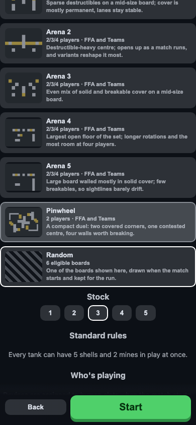
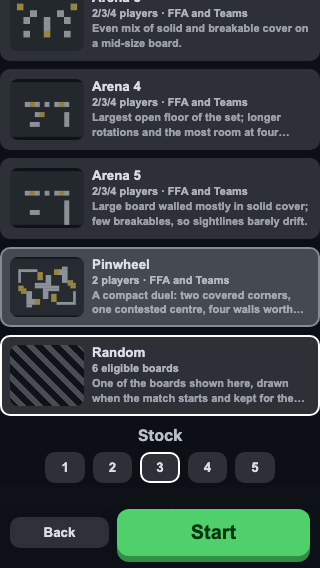
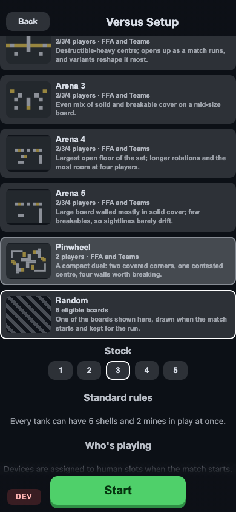
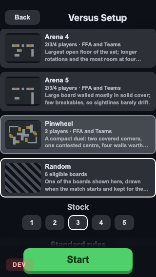

# Issue #668 — Start and Back pinned to the foot of Versus Setup

Start sat **1462 px down an 844 px screen** — 1.73 screens of scrolling to begin a match, and
**2.66** at 320×568.

## Four shapes were built into the running page and measured

| | Start Y | screens | verdict |
| --- | --- | --- | --- |
| shipped | 1462 px | 1.73 | the problem |
| two-column map grid | 1232 px | 1.46 | **rejected** — clips the board copy (text column 288→89 px), and cards get *taller* |
| collapse the map list | 885 px | 1.05 | viable, costs a tap to browse |
| **pin the actions** | always visible | — | **shipped** |

The two-column grid was the original recommendation in the issue. The measurement refuted it.

## What shipped, and what is behind a flag

**Shipped:** Back and Start side by side in a sticky bar at the foot — 83 px, 10% of a 390×844
screen and 15% of 320×568. Stacking them (which is what pinning them unchanged gives) costs
100 px and makes two controls of different weight read as equals.

**`?dev=1&versusActions=header`:** Back lifted into a compact sticky header beside the pane
title, Start alone at the foot. It keeps the title visible while scrolling — but the shipped
layout shows that title at rest anyway, so the arm only preserves it *after* a scroll, and it
costs 142 px: 17% at 390 and **25% at 320**. Worth judging in play; not worth defaulting to.

| | 390×844 | 320×568 |
| --- | --- | --- |
| shipped |  |  |
| `versusActions=header` |  |  |

The full-size header (28 px title) was dropped outright: at 320 px it wrapped "Versus Setup"
onto two lines — 94 px of header, **31%** of the screen.

## Five defects found by scrolling, none visible in a still

1. **12 px peek below the bar**, and **12 px above the header** — the same bug twice. A sticky
   child's containing block is the pane's *content* box, so `padding: 12px 0` on the scroll
   container parks each pinned child short of its scrollport edge and the list scrolls through
   the strip. The padding moved onto the pinned children.
2. **The refusal scrolled away from the button it explains.** Pinning Start leaves a dead
   control with its reason ~1400 px up the pane. The reason moved into the bar.
3. **The fade was a percentage** of a bar that grows when that refusal appears, so the reason
   landed inside the translucent band and a board card read through it. Fixed height now, with
   the bar's own padding clearing it.
4. **A fade on the header was wrong outright** — the header's own content sits in it, so a
   board card slid up *beside* the pane title. Headers get solid ground.
5. **`background: var(--colour), linear-gradient(…)` is invalid CSS.** A colour may only be the
   last layer, so the whole declaration is dropped and the element renders fully transparent —
   a total, silent failure rather than a wrong shade.

Measured after: `gapAbove = 0, gapBelow = 0` at every scroll position, in both arms, at both
widths.
