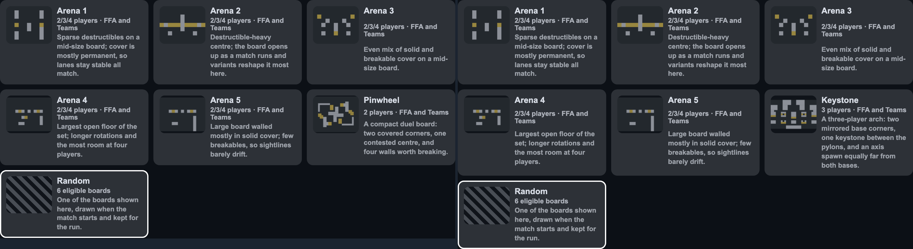
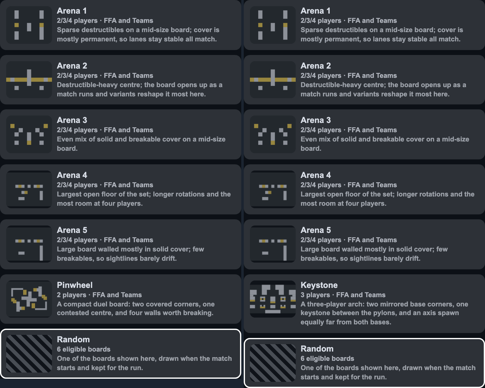
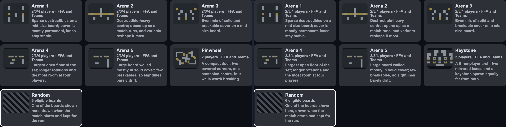
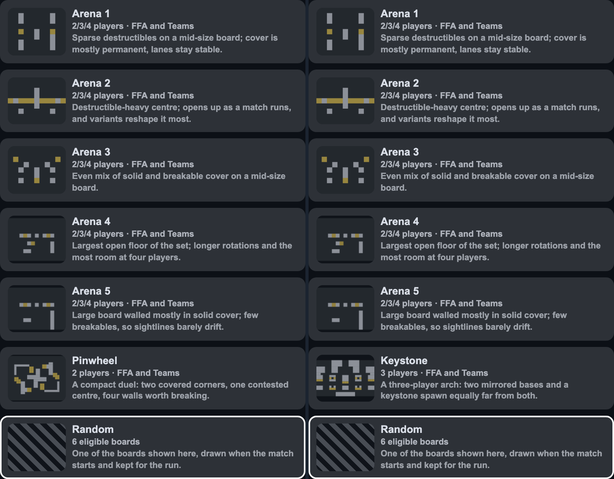

# Versus map cards: one height, whatever boards the row offers

Owner report: *"the teams unavailable copy changes the size of the map selection previews
when it shouldn't."*

## The note was not the cause

MEASURED in Chromium: toggling `.hud-versus-mode-note` alone, with the player count held
fixed, moves **nothing** — the card stays 240x137.22 at 1280x800 and 390x80.69 at 390x844.
The pane is viewport-bound, not content-sized, so the note cannot widen it.

## What actually resized

Grid rows are equal-height, and a card's height follows how far its **intent** wraps. Changing
the player count re-filters the board list, so a different intent lands in the row — and every
card beside it resizes. The note just happens to disappear at the same moment.

| players | row-2 boards | card height |
| --- | --- | --- |
| 2 | Arena 4, Arena 5, **Pinwheel** | **122.4px** |
| 3 | Arena 4, Arena 5, **Keystone** | **140.1px** |
| 4 | Arena 4, Arena 5, **Quarters** | **140.1px** |

The preview canvas itself is a fixed 74px and never moved.

## Before — 2 players (left) vs 3 players (right)

Row 2 grows and pushes Random down. These two screenshots could not even be stacked without
padding: the row is **774px** at two players and **808px** at three.

On phone (one column, so no row to share) only the Keystone card is odd: 95.5px against 80.7px.
The row is 1226px vs 1256px.

## After

Every card is one height, and the two states are identical.

| | before | after |
| --- | --- | --- |
| desktop board cards | 122.4 / 137.2 / 140.1, moving with the list | **122.4, every board, every count** |
| phone cards | 80.7 / 95.5 | **80.7, every card, every count** |
| desktop map row, 2p vs 3p | 774 vs 808 | **identical** |
| phone map row, 2p vs 3p | 1226 vs 1256 | **identical** |

Random stays 110.4 on desktop. It is always alone in the last row (the grid caps at 46rem and
resolves to three columns, so seven cards lay out 3 + 3 + 1), and grid rows are already
equal-height, so no card ever sits beside it to mismatch.

## How

Shorten **and** clamp, per the owner's call:

- Five intents shortened (the longest was Keystone at 127 characters, now 83). Nothing is
  truncated today — the longest shipped intent is 85 against an 88-character bound pinned in
  `versus-catalog.test.ts`.
- `-webkit-line-clamp` **plus** a matching `min-height` on `.hud-versus-map-intent`. Both are
  needed: the clamp caps a long intent, the min-height stops a short one (Arena 3) leaving its
  card shorter. A clamp alone sets only a maximum.
- The line count is per breakpoint because the text column is: **138px** beside the canvas in a
  240px desktop grid column, **288px** in the single full-width column below 760px. Four lines
  there is two here; forcing four on a phone would add ~30px of whitespace per card down a
  seven-card column.
- The config line gets **no** reserved height. A draft gave it one, to raise Random to meet
  the boards, and it was removed after looking at the render: it bought a cross-row difference
  nobody can see and cost a blank line inside Random's card that read as missing copy.
